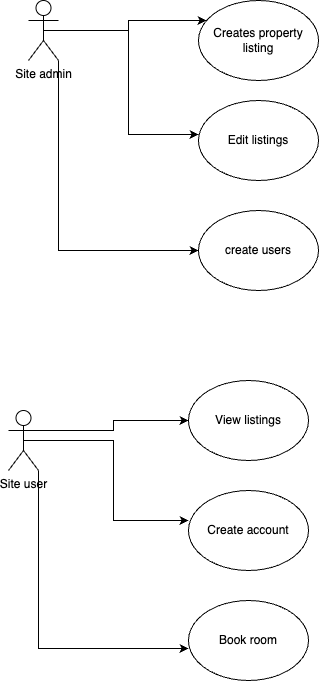

# Requirement Analysis in Software Development

Welcome to the **Requirement Analysis** project repository. This repository provides a structured blueprint for conducting requirement analysis on a booking management system. Here, you'll find detailed documentation, diagrams, and acceptance criteria that mirror real-world software development practices.

---

## Table of Contents

1. [What is Requirement Analysis?](#what-is-requirement-analysis)
2. [Why is Requirement Analysis Important?](#why-is-requirement-analysis-important)
3. [Key Activities in Requirement Analysis](#key-activities-in-requirement-analysis)
4. [Types of Requirements](#types-of-requirements)

   * [Functional Requirements](#functional-requirements)
   * [Non-functional Requirements](#non-functional-requirements)
5. [Use Case Diagrams](#use-case-diagrams)
6. [Acceptance Criteria](#acceptance-criteria)

---

## What is Requirement Analysis?

Requirement Analysis is the process of gathering, documenting, and validating the needs and constraints of stakeholders for a software system. It serves as the foundational activity in the Software Development Lifecycle (SDLC), ensuring that developers, clients, and users share a clear and common understanding of what the system must achieve.

* **Purpose**: To translate business objectives and user needs into precise specifications.
* **Outcome**: A formalized set of requirements that guide design, development, testing, and deployment.

---

## Why is Requirement Analysis Important?

Requirement Analysis is critical because it:

1. **Reduces Risk of Project Failure**: Clear requirements minimize misunderstandings and scope creep.
2. **Improves Cost and Schedule Estimates**: Detailed analysis enables accurate planning and resource allocation.
3. **Enhances Stakeholder Communication**: Establishes a single source of truth for all parties involved.

---

## Key Activities in Requirement Analysis

* **Requirement Gathering**: Collecting raw data from stakeholders through interviews, surveys, and document reviews.
* **Requirement Elicitation**: Engaging stakeholders to refine and articulate their needs.
* **Requirement Documentation**: Structuring gathered information into formal artifacts (e.g., user stories, use cases).
* **Requirement Analysis and Modeling**: Organizing and prioritizing requirements; creating models like data flow and entity-relationship diagrams.
* **Requirement Validation**: Reviewing and verifying requirements with stakeholders to ensure accuracy and completeness.

---

## Types of Requirements

### Functional Requirements

Functional requirements specify what the system should do. Examples for the booking management system:

* **User Registration**: Users must be able to create an account with email verification.
* **Search Availability**: The system must allow users to search for available rooms by date range and location.
* **Booking Confirmation**: After payment, the system must generate and send a booking confirmation email.

### Non-functional Requirements

Non-functional requirements define system qualities and constraints. Examples for the booking management system:

* **Performance**: The system must handle up to 1,000 concurrent booking searches with response times under 3 seconds.
* **Security**: All user data must be encrypted in transit (TLS 1.2+) and at rest.
* **Usability**: The booking interface must follow WCAG 2.1 Level AA accessibility guidelines.

---

## Use Case Diagrams

Use Case Diagrams visualize system actors and their interactions with the system to capture functional requirements at a high level.

**Diagram Notes**:

* **Actors**: Customer, Admin, Payment Gateway
* **Use Cases**: Register, Search Availability, Make Booking, Process Payment, Manage Bookings

---

## Acceptance Criteria

Acceptance Criteria provide concrete conditions that a feature must satisfy to be considered complete.

**Feature**: Checkout (Booking Confirmation)

* **Given** a logged-in Customer with selected room and dates,
* **When** they submit payment information,
* **Then** the system charges the card through the Payment Gateway,
* **And** generates a booking record in the database,
* **And** sends a confirmation email with booking details within 1 minute.

These criteria ensure that the Checkout feature meets both functional and non-functional expectations.

---

> *This repository was created to guide learners through the requirement analysis phase of SDLC using a hands-on booking management system case study.*

---
